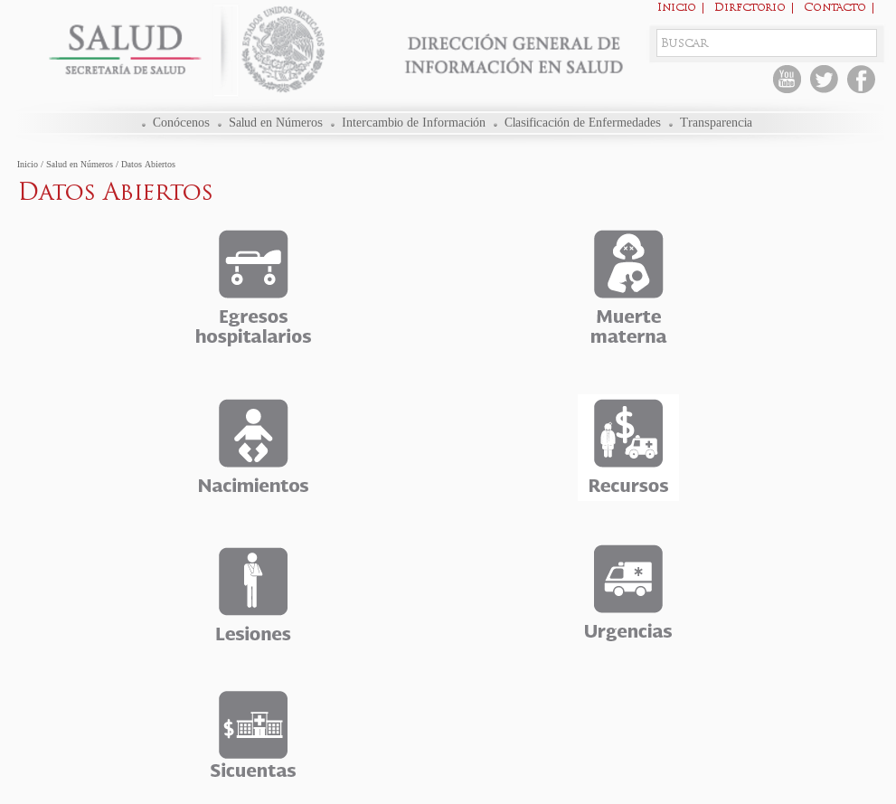

# Secretaría de Salud / Salud en Números / Datos Abiertos

Apuntes y programas para alimentar PostgreSQL a partir de los datos abiertos de la Secretaría de Salud.

### Los archivos con los datos abiertos se encuentran en:

    http://www.dgis.salud.gob.mx/contenidos/basesdedatos/Datos_Abiertos.html

### Imagen de esa página web al 30 de mayo de 2016:

### Primeros pasos para crear la base de datos

Si no lo ha hecho, cree el usuario 'salud' para PostgreSQL

    $ createuser -D -S salud

Cree la base de datos secretaria_de_salud:

    $ createdb -O salud secretaria_de_salud

Para empezar de nuevo, elimine la base de datos con:

    $ dropdb secretaria_de_salud
